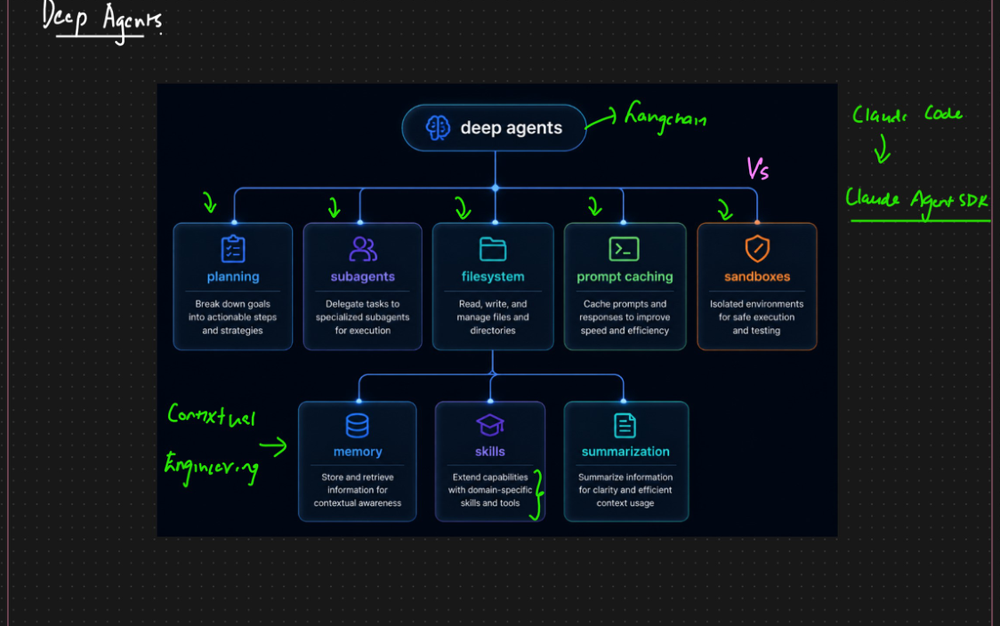
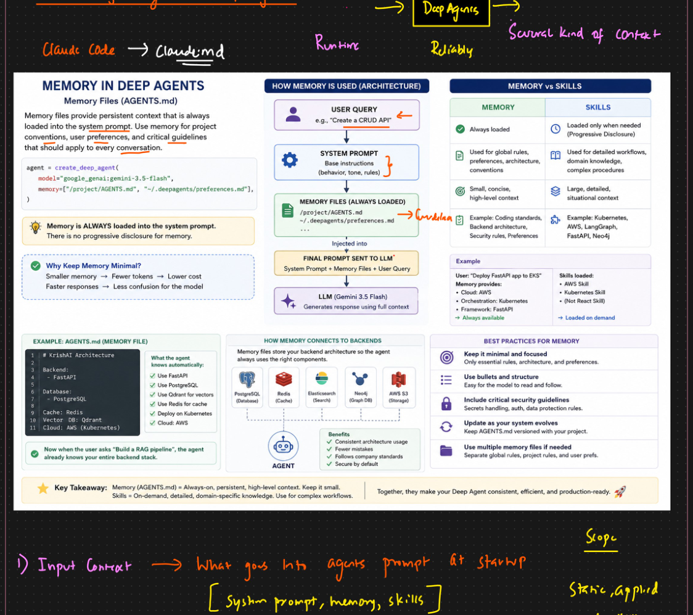
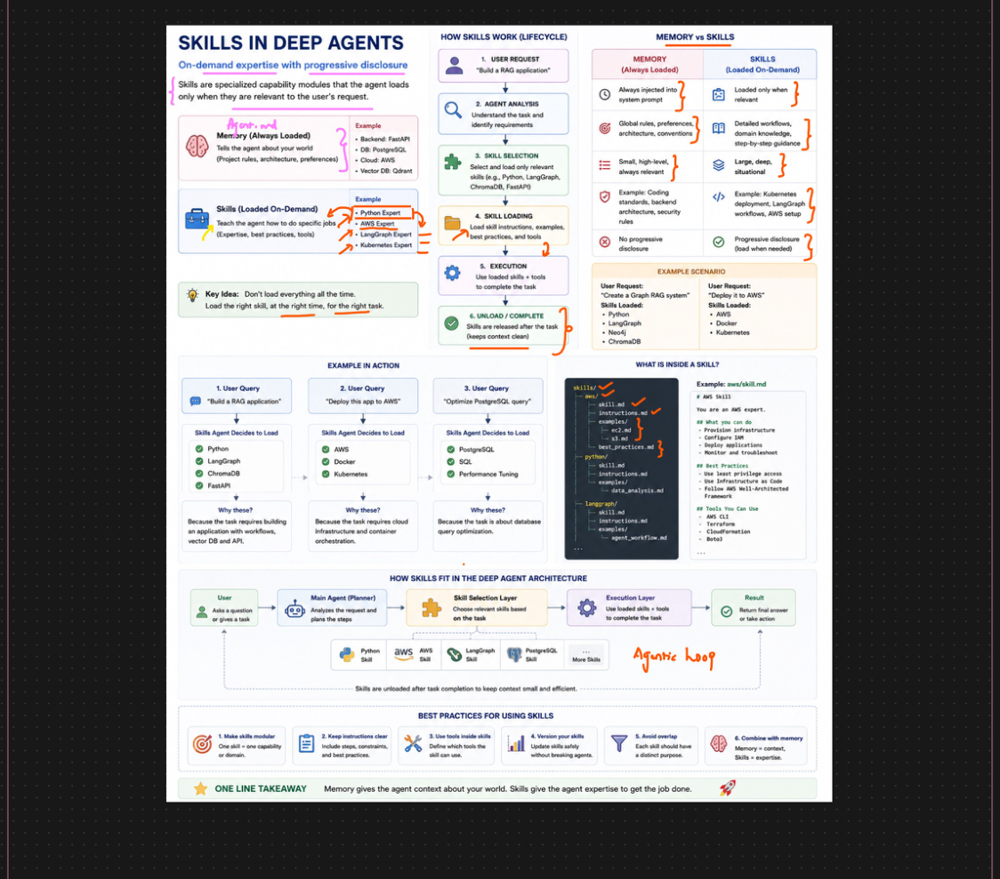
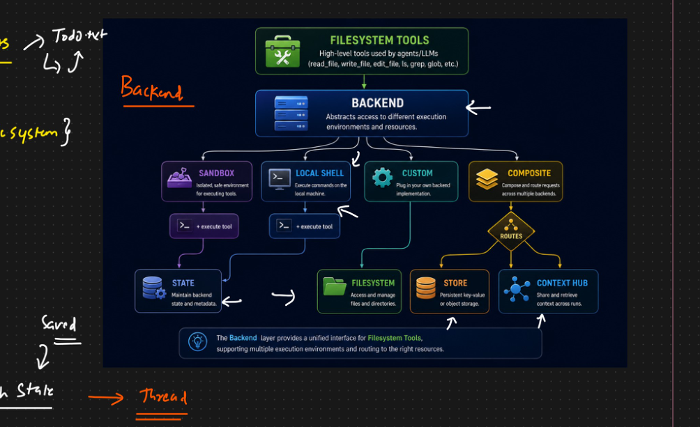
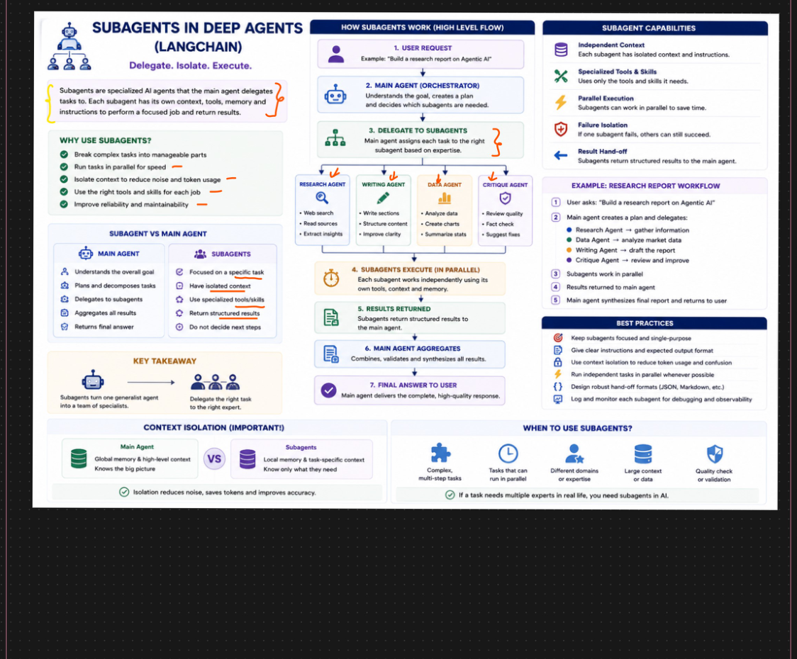

# 🧠 Deep Agents — Comprehensive Project Guide

> A full-featured chatbot and agent framework built on the `deepagents` library (LangChain + LangGraph), demonstrating planning, context engineering, skills, filesystem backends, and multi-agent orchestration — all wrapped in a Streamlit UI.

---

## Table of Contents

- [What Is Deep Agents?](#what-is-deep-agents)
- [Deep Agents vs Claude Agent SDK](#deep-agents-vs-claude-agent-sdk)
- [Project Structure](#project-structure)
- [Installation & Setup](#installation--setup)
- [Core Concepts from the PDF](#core-concepts-from-the-pdf)
  - [1. The Seven Pillars of Deep Agents](#1-the-seven-pillars-of-deep-agents)
  - [2. Context Engineering](#2-context-engineering)
  - [3. Skills — On-Demand Expertise](#3-skills--on-demand-expertise)
  - [4. Filesystem & Backends](#4-filesystem--backends)
  - [5. Subagents — Delegate, Isolate, Execute](#5-subagents--delegate-isolate-execute)
- [Code Walkthrough: `streamlit_app.py`](#code-walkthrough-streamlit_apppy)
  - [Imports & Environment Setup](#imports--environment-setup)
  - [Custom Tool: `internet_search`](#custom-tool-internet_search)
  - [Structured Output Schema: `ResearchFindings`](#structured-output-schema-researchfindings)
  - [Context Engineering Helpers](#context-engineering-helpers)
  - [Agent Factory: `build_agent()`](#agent-factory-build_agent)
  - [Rendering Helpers](#rendering-helpers)
  - [Streamlit App: Session State & UI](#streamlit-app-session-state--ui)
  - [Chat Input & Agent Invocation](#chat-input--agent-invocation)
- [requirements.txt Explained](#requirementstxt-explained)
- [Key Concepts Deep Dive](#key-concepts-deep-dive)
  - [Memory vs Skills — Critical Distinction](#memory-vs-skills--critical-distinction)
  - [Context Isolation in Subagents](#context-isolation-in-subagents)
  - [The Agentic Loop](#the-agentic-loop)
- [Architecture Diagrams](#architecture-diagrams)
- [Usage Guide](#usage-guide)

---

## What Is Deep Agents?

**Deep Agents** is a framework built on top of LangChain and LangGraph that enables you to build long-running, multi-agent AI systems. The core function is `create_deep_agent()` — a factory that wires together:

- A **planning engine** (automatically breaks tasks into todos)
- A **virtual filesystem** (agents can read, write, and edit files)
- **Memory** (persistent context loaded on every run via `AGENTS.md`)
- **Skills** (on-demand domain expertise loaded only when needed)
- **Subagents** (specialized AI workers with isolated context)
- **Prompt caching** (speed and cost savings)
- **Sandboxed execution** (safe environment for running tools)

Think of it as turning a single LLM call into a small team of experts that plan, delegate, research, and synthesize results autonomously.

---

## Deep Agents vs Claude Agent SDK

The PDF provides a detailed side-by-side comparison — here is the key distinction:

| Feature | Deep Agents (LangChain) | Claude Agent SDK (Anthropic) |
|---|---|---|
| **Primary Goal** | Build long-running, multi-agent workflows | Extend Claude Code to build powerful agents |
| **Foundation** | LangChain + LangGraph | Claude Code infrastructure |
| **Model Support** | OpenAI, Anthropic, Gemini, Grok, local models | Claude models only (Opus, Sonnet, Haiku) |
| **Core Strength** | Multi-agent orchestration & planning | Tool use, runtime, developer productivity |
| **Subagents** | Native hierarchical subagents | Subagents & delegation via Claude runtime |
| **Context Management** | Explicit context isolation & quarantine | Managed by Claude Code runtime |
| **Skills** | Built-in skills system | Skills support through Claude ecosystem |
| **Hooks / Events** | Limited (via LangGraph workflows) | Powerful event-driven hooks |
| **MCP Support** | Yes | Yes |
| **Multi-Agent** | Core design principle | Supported, not the primary focus |
| **Human-in-the-loop** | Via LangGraph workflows | Hooks, permissions & approvals |
| **Observability** | Native integration with LangSmith | External observability (logs, tracing) |
| **Vendor Lock-in** | Very Low | Higher (Claude ecosystem) |

**Bottom line:** Choose Deep Agents when you need true multi-agent orchestration with model flexibility. Choose Claude Agent SDK when you are building coding/CLI/IDE agents deeply integrated with Claude Code.

---

## Project Structure

```
Deep-Agent/
├── streamlit_app.py        # Main application — the full chatbot UI
├── requirements.txt        # Python dependencies
├── .gitignore
└── demo/                   # Demo notebooks and supporting files
    ├── projects/
    │   └── AGENTS.md       # Memory file — always loaded into system prompt
    └── skills/             # Domain-specific skill markdown files
        ├── python/
        │   └── skill.md
        ├── aws/
        │   └── skill.md
        ├── langgraph/
        │   └── skill.md
        └── ...
```

The `demo/` folder mirrors how a real production agent project would be organized — it contains the persistent memory (`AGENTS.md`) that tells the agent who it is, and the skills library of domain expertise it can draw on.

---

## Installation & Setup

```bash
# 1. Clone the repository
git clone https://github.com/BikashBIOS/Deep-Agent.git
cd Deep-Agent

# 2. Create and activate a virtual environment (recommended)
python -m venv venv
source venv/bin/activate       # Linux/Mac
# venv\Scripts\activate        # Windows

# 3. Install all dependencies
pip install -r requirements.txt

# 4. Create your .env file with API keys
cat > .env << 'EOF'
GROQ_API_KEY=your_groq_api_key_here
TAVILY_API_KEY=your_tavily_api_key_here
EOF

# 5. Run the Streamlit app
streamlit run streamlit_app.py
```

**Where to get API keys:**
- Groq: https://console.groq.com — free tier available, very fast inference
- Tavily: https://tavily.com — web search API for agents, has a free tier

---

## Core Concepts from the PDF

### 1. The Seven Pillars of Deep Agents

The PDF's architecture diagram (Page 1) shows that `deep agents` provides seven core capabilities:



| Pillar | What It Does |
|---|---|
| **Planning** | Automatically breaks goals into actionable steps using `write_todos` |
| **Subagents** | Delegates tasks to specialized sub-agents for focused execution |
| **Filesystem** | Reads, writes, and manages files and directories via a virtual FS |
| **Prompt Caching** | Caches prompts and responses to improve speed and reduce cost |
| **Sandboxes** | Isolated environments for safe execution and testing |
| **Memory** | Stores and retrieves information for contextual awareness across runs |
| **Skills** | Extends capabilities with domain-specific skills and tools |
| **Summarization** | Summarizes information for clarity and efficient context usage |

These map directly to the four types of context that the PDF's "Context Engineering" section describes:
1. **Input Context** → What goes into the agent's prompt at startup (system prompt, memory, skills)
2. **Runtime Context** → What the agent discovers and creates during execution
3. **Context Compression** → Summarization to keep the context window lean
4. **Context Isolation** → Subagents each get only the context they need

---

### 2. Context Engineering

The PDF dedicates an entire section to "Context Engineering in Deep Agents" (Page 2). The key insight is that **the agent only performs as well as the context it receives**.



#### How Memory Works

**Memory files** (primarily `AGENTS.md`) are always loaded into the system prompt before any user query reaches the LLM. The flow is:

```
USER QUERY
    ↓
SYSTEM PROMPT (base instructions: behavior, tone, rules)
    ↓
MEMORY FILES ALWAYS LOADED
    /project/AGENTS.md
    ~/.deepagents/preferences.md
    ↓
FINAL PROMPT SENT TO LLM
System Prompt + Memory Files + User Query
    ↓
LLM generates response using full context
```

The `create_deep_agent()` call that sets this up looks like:

```python
agent = create_deep_agent(
    model="google_genai:gemini-3.5-flash",
    memory=["/project/AGENTS.md", "~/.deepagents/preferences.md"],
)
```

The `memory=` parameter accepts a list of file paths. These files are read and injected into **every single invocation** — there is no progressive disclosure for memory.

#### Why Keep Memory Minimal?

The PDF states this explicitly: Smaller memory → Fewer tokens → Lower cost → Faster responses → Less confusion for the model.

Memory should contain only essential rules, architecture, and preferences. A typical `AGENTS.md` might look like:

```markdown
# KrishAI Architecture

Backend:
  - FastAPI

Database:
  - PostgreSQL

Cache: Redis
Vector DB: Qdrant
Cloud: AWS (Kubernetes)
```

With this in place, when the user asks "Build a RAG pipeline," the agent already knows your entire backend stack without being told again.

#### The Four Types of Context (from PDF notes)

| Type | Scope | When Applied |
|---|---|---|
| **Input Context** | System prompt + memory + skills | Static, applied each run at startup |
| **Runtime Context** | Tool results, file reads, subagent outputs | Dynamic, built during execution |
| **Context Compression** | Summarization of long conversations | Applied when context window fills up |
| **Context Isolation** | Each subagent gets its own context | Applied when delegating to subagents |

---

### 3. Skills — On-Demand Expertise

Skills are the counterpart to Memory. While Memory is **always loaded**, Skills are loaded **only when needed** (progressive disclosure).



#### Memory vs Skills — The Critical Distinction

| | Memory | Skills |
|---|---|---|
| **Load timing** | Always loaded | Loaded only when needed |
| **Content** | Global rules, preferences, architecture, conventions | Detailed workflows, domain knowledge, complex procedures |
| **Size** | Small, concise, high-level context | Large, detailed, situational context |
| **Example** | Coding standards, backend architecture, security rules | Kubernetes deployment, AWS LangGraph workflows, FastAPI Neo4j |

**Example scenario:**
- User says: "Deploy FastAPI app to EKS"
- Memory provides: Cloud=AWS, Orchestration=Kubernetes, Framework=FastAPI (always available)
- Skills loaded: AWS Skill, Kubernetes Skill (loaded on demand)
- Skills NOT loaded: React Skill (irrelevant to this task)

#### How Skills Work — The Lifecycle

```
1. USER REQUEST
   "Build a RAG application"
          ↓
2. AGENT ANALYSIS
   Understand the task and identify requirements
          ↓
3. SKILL SELECTION
   Select and load only relevant skills
   (e.g., Python, LangGraph, ChromaDB, FastAPI)
          ↓
4. SKILL LOADING
   Load skill instructions, examples, best practices, and tools
          ↓
5. EXECUTION
   Use loaded skills + tools to complete the task
          ↓
6. UNLOAD / COMPLETE
   Skills are released after the task (keeps context clean)
```

#### What Is Inside a Skill?

A skill file (e.g., `skills/aws/skill.md`) contains:

```markdown
# AWS Skill

You are an AWS expert.

## What you can do
- Provision infrastructure
- Configure IAM
- Deploy applications
- Follow AWS Well-Architected Framework
- Monitor and troubleshoot

## Best Practices
- Use least privilege access
- Use Infrastructure as Code
- Follow AWS Well-Architected Framework

## Tools You Can Use
- AWS CLI
- Terraform
- CloudFormation
- Ansible
```

#### Best Practices for Using Skills

1. **Make skills modular** — one skill = one capability or domain
2. **Keep instructions clear** — include steps, constraints, and best practices
3. **Use tools inside skills** — define which tools the skill can use
4. **Version your skills** — update skills safely without breaking agents
5. **Avoid overlap** — each skill should have a distinct purpose
6. **Combine with memory** — Memory = context, Skills = expertise

---

### 4. Filesystem & Backends

Deep Agents provides a virtual filesystem abstraction (Page 4) so agents can read, write, and edit files regardless of where those files actually live.



#### The Backend Layer

The **Backend** abstracts access to different execution environments. The filesystem tools (`read_file`, `write_file`, `edit_file`, `ls`, `glob`, `grep`) always work the same way — the backend decides where the data actually goes.

| Backend Type | Description | Use Case |
|---|---|---|
| **Sandbox** | Isolated, safe environment for executing tools | Testing, untrusted code |
| **Local Shell** | Execute commands on the local machine | Development, scripts |
| **Custom** | Plug in your own backend implementation | Enterprise integrations |
| **Composite** | Compose and route requests across multiple backends | Complex systems |

#### What Routes To

- **State** — Maintain backend state and metadata (think LangGraph State → Thread)
- **Filesystem** — Access and manage files and directories
- **Store** — Persistent key-value or object storage
- **Context Hub** — Share and retrieve context across runs

The PDF notes this connection: `LangGraph State → Thread` — meaning the state backend is scoped to a LangGraph thread, giving each conversation its own isolated working memory.

#### Three Backends in This Project

The Streamlit app exposes three backend choices:

```
StateBackend (in-state, per thread)
    └─ Files live in LangGraph state; ephemeral per thread
    └─ For AGENTS.md + skills: seeded into state at startup

FilesystemBackend (real disk)
    └─ virtual_mode=True confines agent inside demo/ directory
    └─ AGENTS.md and skills/ already exist on disk

StoreBackend (cross-thread store)
    └─ Survives across conversations using InMemoryStore
    └─ Seeded once per session, accessible to all threads
```

---

### 5. Subagents — Delegate, Isolate, Execute

Subagents are specialized AI agents that the main agent delegates tasks to. This is the core innovation of Deep Agents — turning one generalist agent into a team of specialists.



#### Why Subagents?

- Break complex tasks into manageable parts
- Run tasks in parallel for speed
- Isolate context to reduce noise and token usage
- Use the right tools and skills for each job
- Improve reliability and maintainability

#### Main Agent vs Subagent

| Main Agent | Subagents |
|---|---|
| Understands the overall goal | Focused on a specific task |
| Plans and decomposes tasks | Have isolated context |
| Delegates to subagents | Use specialized tools/skills |
| Aggregates all results | Return structured results |
| Returns final answer | Do not decide next steps |

**Key insight:** Subagents have **isolated context**. The main agent has global memory and the big picture; subagents know only what they need to do their specific job. This isolation reduces noise, saves tokens, and improves accuracy.

#### How Subagents Work — High Level Flow

```
1. USER REQUEST
   "Build a research report on Agentic AI"
          ↓
2. MAIN AGENT (ORCHESTRATOR)
   Understands the goal, creates a plan, decides which subagents are needed
          ↓
3. DELEGATE TO SUBAGENTS
   Main agent assigns each task to the right subagent based on expertise
          ↓
4. SUBAGENTS EXECUTE (IN PARALLEL)
   Each subagent works independently using its own tools, context, and memory
          ↓
5. RESULTS RETURNED
   Subagents return structured results to the main agent
          ↓
6. MAIN AGENT AGGREGATES
   Combines, validates, and synthesizes all results
          ↓
7. FINAL ANSWER TO USER
   Main agent delivers the complete, high-quality response
```

#### Subagent Capabilities

- **Independent Context** — each subagent has isolated context and instructions
- **Specialized Tools & Skills** — uses only the tools and skills it needs
- **Parallel Execution** — subagents can work simultaneously to save time
- **Failure Isolation** — if one subagent fails, others can still succeed
- **Result Hand-off** — subagents return structured results to the main agent

---

## Code Walkthrough: `streamlit_app.py`

The main application is `streamlit_app.py` — 416 lines of Python that demonstrate every concept from the companion notebooks. Let's walk through it section by section.

---

### Imports & Environment Setup

```python
import os
import uuid
from pathlib import Path
from typing import Literal

import streamlit as st
from dotenv import load_dotenv
from pydantic import BaseModel, Field

ROOT_DIR = Path(__file__).parent      # Directory containing this script
DEMO_DIR = ROOT_DIR / "demo"          # Path to demo/ folder with AGENTS.md + skills

load_dotenv(ROOT_DIR / ".env")        # Load GROQ_API_KEY and TAVILY_API_KEY from .env
```

**What's happening:** `ROOT_DIR` and `DEMO_DIR` use `pathlib.Path` to build cross-platform file paths. `load_dotenv` reads the `.env` file so API keys never need to be hardcoded.

```python
from deepagents import create_deep_agent
from deepagents.backends import FilesystemBackend, StateBackend, StoreBackend
from deepagents.backends.utils import create_file_data
from langgraph.checkpoint.memory import MemorySaver
from langgraph.store.memory import InMemoryStore
from tavily import TavilyClient
```

**What's happening:** All the heavyweight imports:
- `create_deep_agent` — the core factory function from `deepagents`
- `FilesystemBackend`, `StateBackend`, `StoreBackend` — the three backend options
- `create_file_data` — utility to wrap text into the format deepagents expects for virtual files
- `MemorySaver` — LangGraph's in-memory checkpointer for thread-level conversation memory
- `InMemoryStore` — LangGraph's cross-thread store (survives new thread IDs)
- `TavilyClient` — client for the Tavily web search API

---

### Custom Tool: `internet_search`

```python
tavily_client = TavilyClient(api_key=os.getenv("TAVILY_API_KEY"))

def internet_search(
    query: str,
    max_results: int = 5,
    topic: Literal["general", "news", "finance"] = "general",
    include_raw_content: bool = False,
):
    """Run a web search"""
    return tavily_client.search(
        query,
        max_results=max_results,
        include_raw_content=include_raw_content,
        topic=topic,
    )
```

**What's happening:** This is a plain Python function that the agent can call as a tool. Deep Agents (via LangChain) uses the function signature and docstring to automatically generate the tool description for the LLM. The `Literal["general", "news", "finance"]` type hint tells the LLM which topic values are valid.

The agent will automatically call this function whenever it decides a web search is needed, passing it the right arguments, and the result (a list of search results with URLs and content) is fed back into the context.

---

### Structured Output Schema: `ResearchFindings`

```python
class ResearchFindings(BaseModel):
    """Structured findings from a research task."""
    summary: str = Field(description="Summary of findings")
    confidence: float = Field(description="Confidence score from 0 to 1")
    sources: list[str] = Field(description="List of source URLs")
```

**What's happening:** This Pydantic model defines the **structured output** for one of the subagents. Instead of returning free-form text, the `structured-researcher` subagent will always return a `ResearchFindings` object with a `summary`, a `confidence` score, and a list of `sources`.

This is extremely useful in production — you can parse the subagent's output programmatically rather than having to parse natural language. The `Field(description=...)` arguments are used by the LLM to understand what each field should contain.

---

### Context Engineering Helpers

```python
def load_agents_md() -> str:
    path = DEMO_DIR / "projects" / "AGENTS.md"
    return path.read_text(encoding="utf-8") if path.exists() else ""
```

**What's happening:** Reads the `AGENTS.md` file from disk. This file contains the project's persistent memory — architecture decisions, preferences, conventions. It's read fresh on every agent build so changes take effect immediately.

```python
def load_skill_seed_files() -> dict:
    """Read every file under demo/skills/ and convert it to in-state
    file data so the StateBackend agent can discover and read skills."""
    files = {}
    skills_root = DEMO_DIR / "skills"
    if skills_root.exists():
        for f in skills_root.rglob("*.md"):
            virtual = "/skills/" + f.relative_to(skills_root).as_posix()
            files[virtual] = create_file_data(f.read_text(encoding="utf-8"))
    return files
```

**What's happening:** This function walks the entire `demo/skills/` directory tree and reads every `.md` file. It converts them to a dictionary mapping virtual paths (`/skills/python/skill.md`) to `create_file_data()` objects. This is specifically for the `StateBackend` — since that backend has no disk access, skills must be seeded directly into the agent's state.

The `rglob("*.md")` call finds all markdown files recursively. The `create_file_data()` utility wraps raw text into the format the deepagents virtual filesystem expects.

---

### Agent Factory: `build_agent()`

This is the heart of the application — it assembles all the features based on the sidebar configuration.

```python
DEFAULT_SYSTEM_PROMPT = (
    "You are an expert AI assistant and researcher. You conduct thorough "
    "research using your internet_search tool when needed, plan multi-step "
    "work with write_todos, offload bulky content to files, use your skills "
    "when a query matches one, and delegate deep-dive research to your "
    "subagents. Always cite sources when research was involved."
)
```

This system prompt is the first layer of context. It tells the agent its role, what tools it has, and when to use them.

#### Backend Selection (maps to Notebook 3)

```python
if cfg["backend"] == "StateBackend (in-state, per thread)":
    backend = StateBackend()
    # StateBackend has no disk access -> seed AGENTS.md + skills into state
    if cfg["use_agents_md"]:
        seed_files["/projects/AGENTS.md"] = create_file_data(load_agents_md())
    if cfg["use_skills"]:
        seed_files.update(load_skill_seed_files())
    memory_paths = ["/projects/AGENTS.md"] if cfg["use_agents_md"] else None
```

**StateBackend:** Everything lives in LangGraph's message state. Files are ephemeral — they disappear when the thread ends. Because there's no real disk, AGENTS.md and skills must be seeded as virtual files into the state.

```python
elif cfg["backend"] == "FilesystemBackend (real disk)":
    # virtual_mode=True confines the agent inside deepagentsdemo/
    backend = FilesystemBackend(root_dir=str(DEMO_DIR), virtual_mode=True)
    # AGENTS.md and skills/ already exist on disk — nothing to seed
    memory_paths = ["/projects/AGENTS.md"] if cfg["use_agents_md"] else None
```

**FilesystemBackend:** Files are real, on-disk files under the `demo/` directory. The `virtual_mode=True` is a sandbox — the agent cannot escape the `DEMO_DIR` root to access other parts of your filesystem. No seeding needed since AGENTS.md and skills already exist on disk.

```python
else:  # StoreBackend (cross-thread memory)
    store = st.session_state.store
    backend = StoreBackend(store=store, namespace=lambda rt: ("memories",))
    # Seed durable memory into the store once per session
    if not st.session_state.get("store_seeded"):
        if cfg["use_agents_md"]:
            store.put(("memories",), "/projects/AGENTS.md",
                      create_file_data(load_agents_md()))
        if cfg["use_skills"]:
            for path, data in load_skill_seed_files().items():
                store.put(("memories",), path, data)
        st.session_state.store_seeded = True
    memory_paths = ["/projects/AGENTS.md"] if cfg["use_agents_md"] else None
```

**StoreBackend:** Files live in a LangGraph `InMemoryStore` keyed by `("memories", path)`. The `namespace=lambda rt: ("memories",)` tells the backend which namespace to use. Files here survive across different thread IDs — this means you can start a new conversation (`New Thread` button) and the agent still has access to files written in a previous conversation.

The `st.session_state.get("store_seeded")` guard ensures that skills are only seeded once per session, not on every agent rebuild.

#### Subagent Setup (maps to Notebook 4)

```python
subagents = []
if cfg["use_subagents"]:
    subagents.append({
        "name": "research-agent",
        "description": "Used to research more in depth questions",
        "system_prompt": "You are a great researcher. Research thoroughly "
                         "and cite your sources.",
        "tools": [internet_search],
    })
    subagents.append({
        "name": "structured-researcher",
        "description": "Researches topics and returns structured findings "
                       "(summary, confidence score, source URLs)",
        "system_prompt": "Research the given topic thoroughly. "
                         "Return your findings.",
        "tools": [internet_search],
        "response_format": ResearchFindings,
    })
```

**What's happening:** Two subagents are defined:

1. **research-agent** — a standard free-text researcher. The main agent delegates deep research tasks here. This subagent runs in its own isolated context with its own copy of `internet_search`.

2. **structured-researcher** — same capability but always returns a `ResearchFindings` Pydantic object. The `response_format=ResearchFindings` instructs deepagents to enforce structured output from this subagent.

Each subagent dict needs at minimum: `name`, `description`, `system_prompt`, and `tools`. The `description` is what the main agent sees when deciding which subagent to delegate to — write it clearly.

#### Assembling the Agent

```python
kwargs = dict(
    model=cfg["model"],
    tools=[internet_search],
    system_prompt=cfg["system_prompt"],
    backend=backend,
    checkpointer=st.session_state.checkpointer,  # notebook 2: thread memory
)

if subagents:
    kwargs["subagents"] = subagents

if cfg["use_skills"]:
    kwargs["skills"] = ["/skills/"]              # notebook 2: Agent Skills

if memory_paths:
    kwargs["memory"] = memory_paths              # notebook 2: memory= context loading

if cfg["backend"].startswith("StoreBackend"):
    kwargs["store"] = st.session_state.store

return create_deep_agent(**kwargs), seed_files
```

**What's happening:** The final call to `create_deep_agent()` assembles everything. The key parameters:

- `model` — uses LangChain's `init_chat_model`-style provider:model strings like `"groq:meta-llama/llama-4-scout-17b-16e-instruct"`
- `tools` — list of Python functions the agent can call
- `system_prompt` — layered on top of the built-in deep agent prompt
- `backend` — one of StateBackend, FilesystemBackend, or StoreBackend
- `checkpointer` — `MemorySaver` instance for within-thread conversation memory
- `subagents` — list of subagent dicts
- `skills` — list of paths to skill directories; agent discovers and loads them on demand
- `memory` — list of file paths to always inject into the system prompt
- `store` — required for StoreBackend for cross-thread persistence

---

### Rendering Helpers

#### `extract_text(content)`

```python
def extract_text(content) -> str:
    """AIMessage.content may be a plain string or a list of content blocks."""
    if isinstance(content, str):
        return content
    if isinstance(content, list):
        parts = []
        for block in content:
            if isinstance(block, dict) and block.get("type") == "text":
                parts.append(block.get("text", ""))
            elif isinstance(block, str):
                parts.append(block)
        return "\n".join(parts)
    return str(content)
```

**What's happening:** LangChain's `AIMessage.content` can be either a plain string or a list of content blocks (when using multi-modal models or tool-use responses). This helper normalizes both formats into a simple string. The content block format looks like `[{"type": "text", "text": "..."}, {"type": "tool_use", ...}]`.

#### `render_steps(messages)`

```python
def render_steps(messages):
    """Show the agent's intermediate work: tool calls, todos, subagent tasks."""
    for msg in messages:
        msg_type = getattr(msg, "type", "")
        if msg_type == "ai" and getattr(msg, "tool_calls", None):
            for tc in msg.tool_calls:
                name, args = tc["name"], tc["args"]
                if name == "write_todos":
                    with st.expander("📋 Planning — write_todos", expanded=False):
                        for todo in args.get("todos", []):
                            icon = {"pending": "⬜", "in_progress": "🔄",
                                    "completed": "✅"}.get(todo.get("status"), "⬜")
                            st.markdown(f"{icon} {todo.get('content', todo)}")
                elif name == "task":
                    with st.expander(
                        f"🤖 Subagent — {args.get('subagent_type', 'task')}",
                        expanded=False,
                    ):
                        st.markdown(args.get("description", ""))
                elif name == "internet_search":
                    with st.expander(
                        f"🔎 Web search — \"{args.get('query', '')}\"", expanded=False
                    ):
                        st.json(args)
                elif name in ("write_file", "edit_file", "read_file", "ls",
                               "glob", "grep"):
                    label = args.get("file_path") or args.get("path") or ""
                    with st.expander(f"📁 File system — {name} {label}",
                                     expanded=False):
                        st.json(args)
                else:
                    with st.expander(f"🛠️ Tool — {name}", expanded=False):
                        st.json(args)
```

**What's happening:** This function iterates through all the messages generated during a single agent turn and renders each tool call as a collapsible Streamlit expander. The logic branches on the tool name:

- `write_todos` → Shows the planning checklist with status icons (⬜ pending, 🔄 in progress, ✅ done)
- `task` → Shows which subagent was called and what it was asked to do
- `internet_search` → Shows the search query and parameters
- Filesystem tools (`write_file`, `read_file`, etc.) → Shows file path and arguments
- Any other tool → Generic JSON display

This provides full transparency into the agent's reasoning and actions — you can see exactly how it planned and executed each step.

#### `render_files(files)`

```python
def render_files(files: dict):
    if not files:
        return
    with st.expander(f"🗂️ Virtual files in state ({len(files)})", expanded=False):
        for path, data in files.items():
            content = data.get("content", "") if isinstance(data, dict) else str(data)
            st.markdown(f"**`{path}`**")
            st.code(content[:1500] + (" …(truncated)" if len(content) > 1500 else ""))
```

**What's happening:** Shows any new virtual files that the agent created during its turn. The `files` dict maps virtual paths to file content. Content is truncated at 1500 characters to keep the UI readable.

---

### Streamlit App: Session State & UI

```python
st.set_page_config(page_title="Deep Agents Chatbot", page_icon="🧠", layout="wide")
st.title("🧠 Deep Agents Chatbot")
```

```python
# --- session state init ---
if "checkpointer" not in st.session_state:
    st.session_state.checkpointer = MemorySaver()
if "store" not in st.session_state:
    st.session_state.store = InMemoryStore()
if "thread_id" not in st.session_state:
    st.session_state.thread_id = str(uuid.uuid4())
if "history" not in st.session_state:
    st.session_state.history = []  # [(role, text, steps_messages, files)]
```

**What's happening:** Streamlit reruns the entire script on every user interaction. `st.session_state` is how you preserve values across reruns. Here:

- `checkpointer` — the `MemorySaver` that holds all conversation history for all threads
- `store` — the `InMemoryStore` for cross-thread persistent storage (StoreBackend)
- `thread_id` — a UUID that identifies the current conversation thread
- `history` — the display history as a list of `(role, text, steps_messages, files)` tuples

The `if "key" not in st.session_state:` pattern initializes these only once — on the very first page load.

```python
# Rebuild the agent only when the configuration changes
cfg_key = str(sorted(cfg.items()))
if st.session_state.get("cfg_key") != cfg_key:
    st.session_state.agent, st.session_state.seed_files = build_agent(cfg)
    st.session_state.cfg_key = cfg_key
```

**What's happening:** This is an important optimization. Building the agent is not trivial — it sets up backends, reads files, creates subagents, etc. By serializing the configuration dict as a string and comparing it to the previous value, the app only rebuilds the agent when the user actually changes a sidebar setting.

---

### Chat Input & Agent Invocation

```python
if prompt := st.chat_input("Ask me anything — research, code, AWS, LangGraph…"):
    with st.chat_message("user"):
        st.markdown(prompt)
    st.session_state.history.append(("user", prompt, None, None))

    payload = {"messages": [{"role": "user", "content": prompt}]}

    # StateBackend: seed AGENTS.md + skills into this thread's virtual FS
    if st.session_state.seed_files:
        payload["files"] = st.session_state.seed_files

    config = {"configurable": {"thread_id": st.session_state.thread_id},
              "recursion_limit": 100}
```

**What's happening:** The `:=` walrus operator captures the user's input and only enters the block if the input is non-empty. The `payload` is the input to the agent — a standard LangGraph state dict with a `messages` key. The `files` key is special to deepagents/StateBackend: it seeds the virtual filesystem for this thread.

The `config` dict is standard LangGraph configuration:
- `thread_id` — identifies which conversation thread to use (the `checkpointer` stores state per thread_id)
- `recursion_limit: 100` — how many LangGraph node transitions to allow before halting (prevents infinite loops)

```python
    with st.chat_message("assistant"):
        with st.spinner("🧠 Deep agent planning, researching, delegating…"):
            try:
                result = st.session_state.agent.invoke(payload, config=config)
            except Exception as e:
                st.error(f"Agent error: {e}")
                st.stop()
```

**What's happening:** `agent.invoke()` is a synchronous call that runs the entire agentic loop: planning → tool calls → subagent delegation → result aggregation. The `st.spinner` shows while this is happening. On error, the exception is displayed and `st.stop()` halts further processing for this turn.

```python
        # Only render the messages generated for THIS turn
        all_msgs = result["messages"]
        turn_start = max(
            (i for i, m in enumerate(all_msgs)
             if getattr(m, "type", "") == "human"),
            default=0,
        )
        new_msgs = all_msgs[turn_start + 1:]
```

**What's happening:** Because the `checkpointer` accumulates all messages across the entire conversation, `result["messages"]` contains every message from the beginning — not just the current turn. This code finds the index of the most recent human message and slices out only the new messages from this turn. This prevents re-rendering old steps on every new turn.

```python
        render_steps(new_msgs)
        answer = extract_text(all_msgs[-1].content) or "*(no text response)*"
        st.markdown(answer)

        # Virtual files (StateBackend) — filter out seed files
        files = {
            p: d for p, d in result.get("files", {}).items()
            if p not in st.session_state.seed_files
        }
        render_files(files)

        st.session_state.history.append(("assistant", answer, new_msgs, files))
```

**What's happening:** The final answer is always `all_msgs[-1]` — the last message in the chain, which is the final AI response. New virtual files are filtered to exclude seed files (AGENTS.md, skills) so the UI only shows files the agent created during this turn.

---

## requirements.txt Explained

```
deepagents          # Core framework: create_deep_agent, backends, skills system
ipykernel           # Jupyter notebook support for the demo/ notebooks
langchain-groq      # Groq LLM provider adapter for LangChain
langchain           # Core LangChain: tools, messages, chains
tavily-python       # Tavily web search API client
python-dotenv       # Load .env files for API key management
langchain-openai    # OpenAI LLM provider adapter (also used by some Groq models)
langchain_quickjs   # QuickJS JavaScript runtime for LangChain agents
streamlit           # Web UI framework — the app runs in this
```

**Notable dependency notes:**

- `langchain_quickjs` enables agents to safely evaluate JavaScript expressions — useful for calculations, data transformations, and scripting tasks without launching a full subprocess.
- `langchain-groq` and `langchain-openai` are both included because some Groq models expose an OpenAI-compatible API; having both ensures maximum compatibility.
- `deepagents` is the central dependency — it pulls in `langgraph`, `langchain`, and related packages as transitive dependencies.

---

## Key Concepts Deep Dive

### Memory vs Skills — Critical Distinction

This is the most important design decision when building with Deep Agents. The PDF summarizes it as:

> **Memory gives the agent context about your world. Skills give the agent expertise to get the job done.**

In practical terms:
- Put **who the agent is** and **what your system looks like** in Memory (AGENTS.md)
- Put **how to do specific complex tasks** in Skills (individual skill.md files)

Never put a 5,000-word Kubernetes deployment guide in AGENTS.md. That's a skill. Never put your API endpoint structure in a skill file that only loads when someone asks about AWS. That's memory.

### Context Isolation in Subagents

When the main agent delegates to a subagent via the `task` tool, the subagent receives:
- Its own `system_prompt` (from the subagent definition)
- Its own tools (only the ones specified in the subagent dict)
- The task description from the main agent
- No access to the main agent's memory, other subagents' results, or global context

This isolation is a feature, not a limitation. It means subagents are focused, cheaper to run, and their failures don't corrupt the main agent's context.

### The Agentic Loop

Every call to `agent.invoke()` triggers a loop that looks like this internally:

```
LLM Call → Tool Calls → LLM Call → Tool Calls → ... → Final Response
```

With LangGraph, this is a directed graph. Each LLM call is a node. Each tool execution is another node. The graph keeps running until the LLM produces a response with no tool calls — that's the final answer. The `recursion_limit=100` caps how many times this loop can iterate.

The planning tool (`write_todos`) is special — calling it causes the agent to write out a checklist of steps before executing anything. This makes the agent's reasoning explicit and traceable.

---

## Architecture Diagrams

### Deep Agents Architecture

```
                        USER
                          │
                    ┌─────▼──────┐
                    │ Supervisor  │  ← Main Agent (Planner/Orchestrator)
                    │  / CEO Agent│
                    └──┬──┬──┬──┬┘
                       │  │  │  │
            ┌──────────┘  │  │  └──────────┐
            ▼             ▼  ▼             ▼
    ┌──────────────┐  ┌──────┐  ┌────────┐  ┌──────────┐
    │Research Agent│  │Coding│  │  Data  │  │  Docs    │
    │ Web search   │  │Agent │  │ Agent  │  │  Agent   │
    │ Read sources │  │Write │  │Analyze │  │Create    │
    │ Extract info │  │review│  │data,   │  │reports,  │
    └──────────────┘  │code  │  │charts  │  │summaries │
                      └──────┘  └────────┘  └──────────┘
                           │
              ┌────────────┼──────────────┐
              ▼            ▼              ▼
           Tools       Memory         Databases
        APIs, Scripts  Vector Stores
```

### Context Flow

```
      Input at Startup                During Execution
      ─────────────────               ────────────────
      System Prompt                   Tool Results
           +                               +
      AGENTS.md (Memory)             File Reads/Writes
           +                               +
      Skill Files                    Subagent Results
      (on-demand)                         +
           │                         Web Search Results
           ▼                               │
      ┌──────────┐                         │
      │   LLM    │◄────────────────────────┘
      │  Context │
      └──────────┘
```

---

## Usage Guide

### Sidebar Configuration

| Setting | What It Controls |
|---|---|
| **Model** | Which LLM to use (Groq-hosted models in this project) |
| **Backend** | Where files and memory live (ephemeral state vs disk vs cross-thread store) |
| **Load AGENTS.md** | Whether to inject the persistent memory file into the system prompt |
| **Skills** | Whether to enable on-demand skill loading from `/skills/` |
| **Subagents** | Whether to enable the research-agent and structured-researcher subagents |
| **System Prompt** | Customize the agent's persona and instructions |

### Buttons

- **🆕 New Thread** — starts a fresh conversation but keeps the same agent, store, and configuration. With StoreBackend, files written in the previous thread are still accessible.
- **🗑️ Reset All** — wipes everything: checkpointer, store, thread ID, and chat history. A full clean slate.

### Example Queries to Try

- `"Research the latest developments in LangGraph and write a summary report"` — triggers subagent delegation and file writing
- `"Build me a FastAPI endpoint for user authentication"` — triggers Python skill loading
- `"Deploy this to AWS EKS"` — triggers AWS and Kubernetes skill loading
- `"What are the trending AI papers this week?"` — triggers internet_search and news topic mode

### Understanding the UI

When the agent responds, you may see collapsible sections above the final answer:
- **📋 Planning** — the agent's todo list for this task
- **🤖 Subagent** — a subagent being invoked (click to see what it was asked)
- **🔎 Web search** — a Tavily search query
- **📁 File system** — file read/write operations
- **🗂️ Virtual files** — new files created by the agent this turn

---

*Built with [deepagents](https://pypi.org/project/deepagents/), [LangChain](https://python.langchain.com/), [LangGraph](https://langchain-ai.github.io/langgraph/), [Tavily](https://tavily.com/), and [Streamlit](https://streamlit.io/).*
